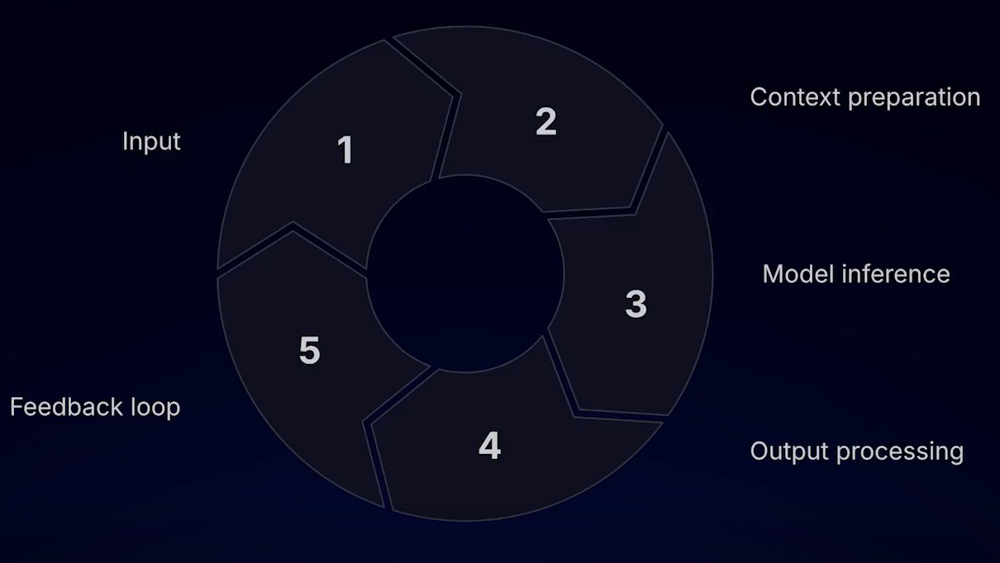
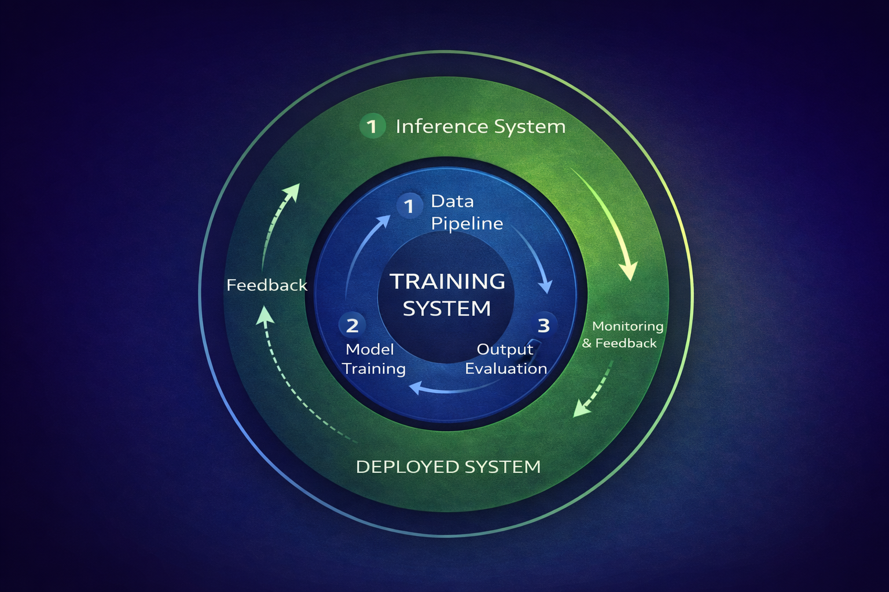

<!-- 
*[Photo by ChatGPT](https://chatgpt.com)* -->

## Module 01 – AI Systems

1) Learning-Based Logic: 

### Traditional software

Input -> Process -> Output

AI Systems

You're not just writing algorithms. You're designing systems that manage flow of information to and from models while handling the unpredictablitiy of nondeterministic AI outputs.

Input -> Process -> Output -> Feedback -|
^---------------------------------------|
This can require multiple loops or even breaks in the loops for humans to intervene or review.

Save Everything with context
- Log every raw event output, error, and user feedback as permanent records. Store models, timestamps, and settings
Run production locally
- Be able to run the pipeline to simulate behavior
Create Feedback Loops
- Retrieve raw event -> run it locally -> fix it -> write a test -> deploy2
Track All Changes
- Save versions of prompts and models. Version everything. Store model with logs to know what version was running
Test for output quality
- Review for output quality. See if they meet standards and compare against previous versions

https://fastapi.tiangolo.com/tutorial/

 FIX THIS